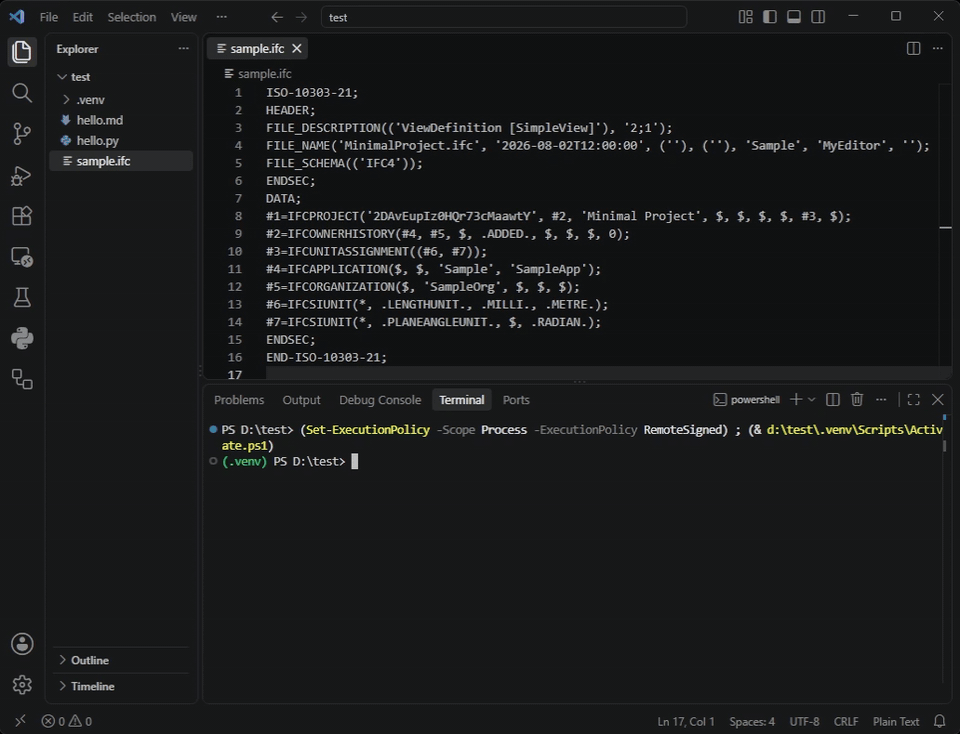

# Live demo

## EXPRESS (ISO 10303-11)

```express title="cartesian_point.exp"
SCHEMA geometry_primitives;

(* An embedded remark, which (* nests *) per ISO 10303-11 clause 7.1.6. *)

CONSTANT
  origin_name : STRING := 'it''s the origin';   -- doubled quote escape
  flag_mask   : BINARY := %10110;
  encoded     : STRING := "000000E9";
END_CONSTANT;

ENTITY cartesian_point
  SUBTYPE OF (geometric_representation_item);
    coordinates : LIST [1:3] OF length_measure;
  DERIVE
    dim : INTEGER := HIINDEX(coordinates);
  WHERE
    valid_dim : SIZEOF(coordinates) <= 3;
END_ENTITY;

FUNCTION dimension_of(item : geometric_representation_item) : INTEGER;
  IF NOT EXISTS(item) THEN
    RETURN (?);
  END_IF;
END_FUNCTION;

END_SCHEMA;  -- tail remark closing the schema
```

## STEP Part 21 (ISO 10303-21)

```step21 title="cartesian_point.p21"
ISO-10303-21;
HEADER;
FILE_DESCRIPTION(('a description','second line'),'2;1');
FILE_NAME(
  'sample.p21',
  '2024-01-01T00:00:00',
  ('Nordm\X2\00F8\X0\ller','it''s me'),
  ('Org'),
  'preprocessor','originating system','authorisation');
FILE_SCHEMA(('SOME_APPLICATION_PROTOCOL'));
ENDSEC;

DATA;
/* a block comment
   spanning lines */
#1=CARTESIAN_POINT('',(0.,0.,0.));
#6=NAMED_UNIT(.T.,.F.,.UNSPECIFIED.);
#8=COMPLEX_ENTITY((0.),(1.));
#9=BINARY_HOLDER("0F3A");
#10=EXTERNAL_REF(!USER_DEFINED_KEYWORD(1));
ENDSEC;

END-ISO-10303-21;
```

Try the same file through the Python API to see token-by-token output, or via
the command line:

```bash
pygmentize -l step21 sample.p21
```



## All registered aliases

Each alias resolves to the same lexer:

| lexer | aliases |
| --- | --- |
| EXPRESS | `express`, `exp`, `iso-10303-11` |
| STEP Part 21 | `step21`, `step`, `p21`, `stp`, `spf`, `iso-10303-21` |

```pycon
>>> from pygments.lexers import get_lexer_by_name, get_lexer_for_filename
>>> get_lexer_by_name("express").name
'EXPRESS'
>>> get_lexer_by_name("exp").name
'EXPRESS'
>>> get_lexer_by_name("iso-10303-11").name
'EXPRESS'
>>> get_lexer_by_name("step21").name
'STEP Part 21'
>>> get_lexer_by_name("p21").name
'STEP Part 21'
>>> get_lexer_by_name("step").name
'STEP Part 21'
>>> get_lexer_by_name("stp").name
'STEP Part 21'
>>> get_lexer_by_name("spf").name
'STEP Part 21'
>>> get_lexer_by_name("iso-10303-21").name
'STEP Part 21'
>>> get_lexer_for_filename("schema.exp").name
'EXPRESS'
>>> get_lexer_for_filename("model.stp").name
'STEP Part 21'
```
